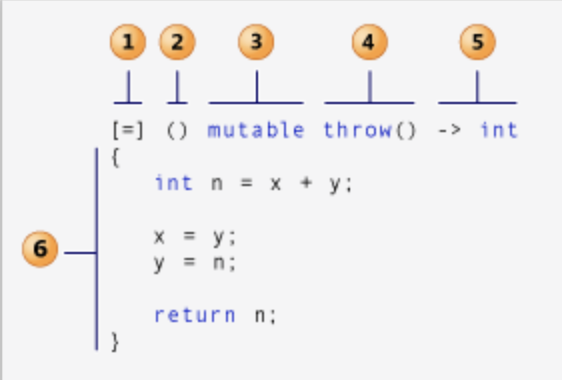

https://docs.microsoft.com/en-us/cpp/cpp/lambda-expressions-in-cpp?view=msvc-170

示例:
```cpp
#include <algorithm>
#include <cmath>

void abssort(float* x, unsigned n) {
    std::sort(x, x + n,
        // Lambda expression begins
        [](float a, float b) {
            return (std::abs(a) < std::abs(b));
        } // end of lambda expression
    );
}
```
Lambda 函数各部分示例图



1. capture clause (Also known as the lambda-introducer in the C++ specification.)
2. parameter list Optional. (Also known as the lambda declarator)
3. mutable specification Optional.
4. exception-specification Optional.
5. trailing-return-type Optional.
6. lambda body.

### Capture clause

```cpp
[&total, factor]
[factor, &total]
[&, factor]
[=, &total]
```

可以通过在开头设置默认 &(引用) 或者 =(赋值), 注意 = 是默认时, 不可以有 =identifier 的形式。

`this`的用法比较特殊

https://www.nextptr.com/tutorial/ta1430524603/capture-this-in-lambda-expression-timeline-of-change

- [this] — Captures *this by reference or &(*this).
- [*this]— Captures *this by value. By-value capture of *this is introduced in C++17.
- [this, *this] — Invalid. Cannot have this more than once.
- [&] — The reference-capture-default can implicitly capture this or &(*this).
- [&, this] — Same as [&], therefore redundant.
- [&, *this] — Valid since C++17, but unlikely to be used.
- [=] — The value-capture-default can implicitly capture this or &(*this). However, the implicit capture of this through [=] is deprecated in C++20.
- [=, this] — Valid only since C++20. C++20 deprecates the implicit capture of this via [=] and allows the explicit capture of this in combination with [=].
- [=, *this] — Valid since C++17.

例子
```cpp
struct S { void f(int i); };

void S::f(int i) {
    [&, i]{};      // OK
    [&, &i]{};     // ERROR: i preceded by & when & is the default
    [=, this]{};   // ERROR: this when = is the default
    [=, *this]{ }; // OK: captures this by value. See below.
    [i, i]{};      // ERROR: i repeated
}
```
